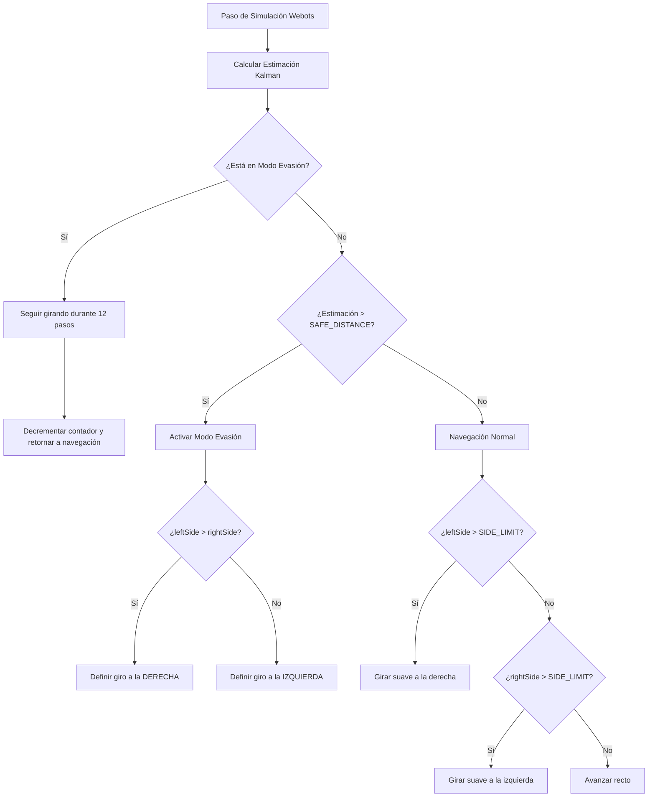

# Laboratorio 2: Navegación reactiva con filtrado y fusión de sensores en Webots

Este repositorio contiene la solución correspondiente al Laboratorio 2 del curso **Robótica y Sistemas Autónomos** (ICI 4150) para el diseño e implementación de un controlador de navegación reactiva en Webots que utiliza fusión sensorial mediante Filtro de Kalman.

---

# Contenido
1. [Integrantes y Datos Generales](#integrantes-y-datos-generales)
2. [Objetivo del Trabajo](#objetivo-del-trabajo)
3. [Descripción del Robot y Sensores](#descripción-del-robot-y-sensores)
4. [Frecuencia de Muestreo](#frecuencia-de-muestreo)
5. [Estimación del Avance con Encoders](#estimación-del-avance-con-encoders)
6. [Filtrado de Mediciones](#filtrado-de-mediciones)
7. [Fusión de Sensores con Filtro de Kalman](#fusión-de-sensores-con-filtro-de-kalman)
8. [Lógica de Navegación Reactiva](#lógica-de-navegación-reactiva)
9. [Instrucciones de Ejecución](#instrucciones-de-ejecución)
10. [Resultados y Escenarios de Prueba](#resultados-y-escenarios-de-prueba)
11. [Análisis Final y Conclusiones](#análisis-final-y-conclusiones)

---

## Integrantes y Datos Generales
- **Integrantes**:
  - Matias Delgadillo
  - Benjamin Gonzalez
  - Javier Montoya
- **Curso**: Robótica y Sistemas Autónomos (ICI 4150)
- **Plataforma**: Webots R2023b (o superior) / Python 3

---

## Objetivo del Trabajo
Implementar un sistema básico de navegación reactiva en Webots para un robot móvil diferencial e-puck utilizando sensores de distancia y encoders de rueda, aplicando un filtro de promedio móvil sobre las lecturas de distancia y empleando un Filtro de Kalman (predicción-corrección) para estimar la proximidad frontal a obstáculos y guiar de forma estable el movimiento del robot.

---

## Descripción del Robot y Sensores
El robot utilizado es el **e-puck**, un robot móvil diferencial equipado con motores de tracción independientes y diversos sensores analógicos de proximidad distribuidos en su chasis.

Para este laboratorio, se utilizan como mínimo los siguientes dispositivos:
- **Sensores de distancia (proximidad)**:
  - `ps0`: Frontal Derecho (a +17° del eje longitudinal)
  - `ps7`: Frontal Izquierdo (a -17° del eje longitudinal)
  - `ps5`: Lateral Izquierdo (a -90° del eje longitudinal)
  - `ps2`: Lateral Derecho (a +90° del eje longitudinal)
- **Encoders**:
  - `left wheel sensor`: Sensor de rotación de la rueda izquierda.
  - `right wheel sensor`: Sensor de rotación de la rueda derecha.

### Configuración del Mapeo de Sensores
*| Nombre del Dispositivo | Función en el Algoritmo | Descripción Física |
| :---: | :---: | :---: |
| `ps0` | Sensor frontal derecho | Medición cruda de obstáculos al frente-derecha |
| `ps7` | Sensor frontal izquierdo | Medición cruda de obstáculos al frente-izquierda |
| `ps5` | Sensor lateral izquierdo | Detección de paredes/obstáculos a la izquierda |
| `ps2` | Sensor lateral derecho | Detección de paredes/obstáculos a la derecha |
| `left wheel sensor` | Encoder izquierdo | Estimación de rotación de la rueda izquierda |
| `right wheel sensor` | Encoder derecho | Estimación de rotación de la rueda derecha |*

⚠️ **Importante**: Los sensores de proximidad por infrarrojos del robot e-puck entregan lecturas analógicas que varían de forma inversa al cuadrado de la distancia (aproximadamente entre $70$ unidades en espacio libre y hasta más de $3000$ unidades al estar en contacto directo con un obstáculo). Es decir, un valor **mayor** indica un obstáculo **más cercano** (proximidad).

---

## Frecuencia de Muestreo
Para asegurar la estabilidad del algoritmo y la consistencia matemática de los filtros en tiempo real, se define una frecuencia de muestreo fija asociada al paso de simulación de Webots:

- **Tiempo de muestreo ($T_s$)**: $50 \text{ ms}$ ($0.05 \text{ s}$)
- **Frecuencia de muestreo ($f_s$)**: $20 \text{ Hz}$ ($f_s = 1/T_s$)
- **Cantidad de muestras por experimento**: $500$ muestras (definido por la constante `MAX_SAMPLES = 500` en el código).

---

## Estimación del Avance con Encoders
La estimación del avance lineal de cada rueda se calcula a partir de las variaciones angulares obtenidas por los encoders en cada paso de tiempo, utilizando la relación matemática del movimiento circular:

$$s = r \cdot \theta$$

Donde:
- $s$: Desplazamiento lineal (metros).
- $r$: Radio de la rueda del robot e-puck ($r = 0.0205 \text{ m}$ / $2.05 \text{ cm}$).
- $\theta$: Desplazamiento angular (diferencia en radianes entre la lectura actual y la lectura anterior del encoder).

El avance lineal acumulado del robot ($\Delta d_k$) se obtiene como el promedio de los desplazamientos lineales de ambas ruedas:

$$\Delta d_k = \frac{s_{\text{izq}} + s_{\text{der}}}{2}$$

---

## Filtrado de Mediciones
Para atenuar el ruido de alta frecuencia propio de los sensores infrarrojos de proximidad antes de alimentar el Filtro de Kalman, se aplica un filtro digital de **Promedio Móvil** de ventana deslizable con tamaño $N = 5$:

$$y_k = \frac{1}{N} \sum_{i=0}^{N-1} x_{k-i}$$

Esto suaviza la señal promediando la lectura de los sensores frontales combinados (`front = (frontRight + frontLeft) / 2`), reduciendo picos de ruido esporádicos.

---

## Fusión de Sensores con Filtro de Kalman
El Filtro de Kalman se implementa para fusionar la odometría (encoders) con las lecturas de proximidad filtradas. Dado que los sensores del e-puck entregan valores más altos al estar más cerca del obstáculo, la variable de estado a estimar es la **proximidad frontal percibida**. Por lo tanto, al avanzar linealmente ($\Delta d_k > 0$), la proximidad al obstáculo aumenta en igual medida.

El filtro consta de dos fases:

### 1. Fase de Predicción (Propagación del Estado)
Se estima el estado futuro del sistema basándose únicamente en el modelo de movimiento del robot:

$$\hat{d}_k^- = \hat{d}_{k-1} + \Delta d_k$$
$$P_k^- = P_{k-1} + Q$$

Donde:
- $\hat{d}_k^-$: Proximidad predicha en el instante $k$.
- $P_k^-$: Covarianza de error de la predicción.
- $Q$: Covarianza del ruido del proceso (ajustado en $Q = 0.15$).

### 2. Fase de Corrección (Actualización con Medición)
Se ajusta la predicción inicial ponderándola con la medición física real ponderada por la Ganancia de Kalman ($K_k$):

$$K_k = \frac{P_k^-}{P_k^- + R}$$
$$\hat{d}_k = \hat{d}_k^- + K_k \cdot (z_k - \hat{d}_k^-)$$
$$P_k = (1 - K_k) \cdot P_k^-$$

Donde:
- $z_k$: Proximidad medida en los sensores frontales (filtrada por promedio móvil).
- $R$: Covarianza del ruido de medición (ajustado en $R = 2.0$).
- $K_k$: Ganancia de Kalman.
- $\hat{d}_k$: Estimación óptima fusionada.
- $P_k$: Covarianza del error corregida.

---

## Lógica de Navegación Reactiva
El controlador toma decisiones de navegación reactiva basándose en la proximidad frontal estimada por Kalman y las lecturas laterales:



### Reglas de Decisión
1. **Evitación Crítica (Modo Evasión)**:
   - Se activa si la proximidad estimada frontal `estimate > SAFE_DISTANCE` ($90$ unidades).
   - Se decide el sentido de giro comparando los sensores laterales: si `leftSide > rightSide` (el obstáculo está más cerca por la izquierda), el robot gira a la **derecha** (`leftMotor = 3`, `rightMotor = -1`); de lo contrario, gira a la **izquierda** (`leftMotor = -1`, `rightMotor = 3`).
   - El robot mantiene este giro de forma robusta por un periodo fijo de $12$ iteraciones (`DECISION_STEPS = 12`) para despejar por completo el obstáculo.
2. **Navegación Normal (Evasión de Paredes Suave)**:
   - Si `leftSide > SIDE_LIMIT` ($150$ unidades), el robot se aleja de la pared izquierda girando suavemente a la derecha (`leftMotor = 3`, `rightMotor = 2`).
   - Si `rightSide > SIDE_LIMIT` ($150$ unidades), el robot se aleja de la pared derecha girando suavemente a la izquierda (`leftMotor = 2`, `rightMotor = 3`).
   - Si no hay obstáculos cercanos, avanza en línea recta a velocidad crucero (`leftMotor = 2`, `rightMotor = 2`).

---

## Instrucciones de Ejecución

Para ejecutar el controlador y visualizar las gráficas de señales de salida:

### Requisitos Previos
Asegúrate de contar con la biblioteca `matplotlib` instalada en el entorno de Python que utiliza tu instalación de Webots:

```bash
pip install matplotlib
```

### Pasos para Simular
1. Abre **Webots**.
2. Selecciona **File > Open World** y abre uno de los mundos provistos en la carpeta del proyecto:
   - Mundos simples: [lab2_simple.wbt](lab2_simple.wbt)
   - Mundos complejos: [lab2_complejo.wbt](lab2_complejo.wbt)
3. Haz clic en el botón **Play (Run/Real-Time)** en la barra de herramientas de Webots para iniciar la simulación.
4. El robot iniciará su navegación reactiva autónoma y el controlador registrará de forma continua los datos.
5. Al alcanzar las $500$ muestras de simulación, la ejecución del controlador se pausará de forma automática y se abrirá una ventana interactiva de `matplotlib` mostrando la gráfica comparativa de la proximidad frontal (Señal Cruda, Promedio Móvil y Fusión de Kalman).

---

## Resultados y Escenarios de Prueba

Se diseñaron y evaluaron dos escenarios fundamentales en el directorio `worlds`:

### 1. Entorno Simple (`lab2_simple.wbt`)
- **Características**: Entorno rectangular cerrado con pocos obstáculos cilíndricos aislados.
- **Comportamiento**: El robot navega en líneas rectas estables. Al aproximarse a un cilindro, la señal de Kalman responde con rapidez suavizando el ruido, permitiendo que el robot tome la decisión de giro a tiempo y de manera suave, sin oscilaciones ni giros falsos.

### 2. Entorno Complejo (`lab2_complejo.wbt`)
- **Características**: Laberinto con múltiples obstáculos, esquinas cerradas y pasillos angostos.
- **Comportamiento**: Se pone a prueba el sistema de evitación activa y la memoria de decisión de 12 pasos. Al entrar en esquinas cerradas, el robot esquiva con éxito las colisiones alternando giros de evasión y navegación normal apoyada en el centrado lateral. La fusión sensorial evita colisiones falsas causadas por picos de ruido del sensor al pasar cerca de los bordes.

---

## Análisis Final y Conclusiones
- **Atenuación de Ruido**: El promedio móvil elimina ruidos transitorios de alta frecuencia, pero introduce un pequeño desfase.
- **Filtro de Kalman**: Al fusionar el avance por odometría, predice de forma óptima la progresión de la proximidad frontal. Cuando la lectura cambia abruptamente debido a ruido puro, la inercia de la predicción y el peso de las covarianzas ($Q$ y $R$) amortiguan estos saltos, logrando una estimación limpia y estable de la proximidad.
- **Estabilidad de Navegación**: La integración de la señal fusionada en las reglas de decisión reduce significativamente la cantidad de giros innecesarios del robot causados por lecturas ruidosas momentáneas, aumentando el rendimiento general de evasión.
